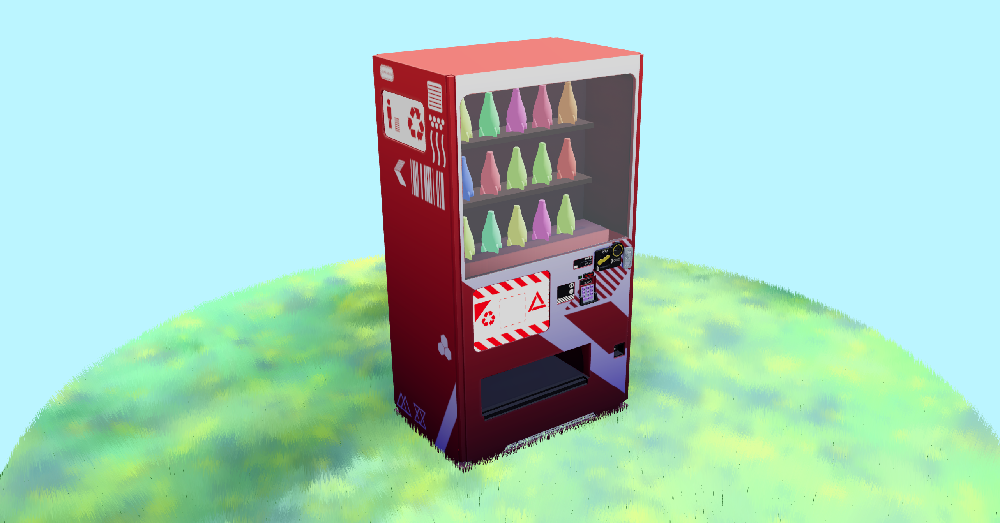

# Vending Machine Three.js Challenge

Welcome to my submission for the Three.js challenge! This project features a vending machine placed in a field of grass, where you can interact with the machine by clicking on it. Each correctly entered code will increase your score, and your final score determines the number of prizes you'll receive from the machine.

## Demo:
Check out the live versions [here](https://www.mistermeo.com/vmachine)!

Feel free to explore the code and provide feedback. If you have any questions or would like to reach out, don't hesitate to contact [me](mailto:gregory.colmont@gmail.com).

Hope you enjoy this mini-game!

## How to Play
Click on the vending machine to interact with it.
Type in a series of codes correctly.
Each correctly entered code will add +1 to your score.
Your final score determines the number of prizes you'll receive from the vending machine.
How many prizes will you be able to get ?

## Special Thanks
James Smyth: A special thanks to James Smyth for his insightful article on Breathe of the Wild Style grass in Three.js. I adapted his shader for the grass in a separate component in React Three Fiber (r3f) to make it easily reusable. Check out his work at [smythdesign.com](https://www.smythdesign.com).

metrosp: The 3D model of the vending machine used in this project is sourced from metrosp on Sketchfab.
